Repositories
- <b>상담관리</b> - https://github.com/JayTHun/consult.git
- <b>일정관리</b> - https://github.com/JayTHun/schedule.git
- <b>마이페이지</b> - https://github.com/JayTHun/board.git
- <b>게이트웨이</b> - https://github.com/JayTHun/gateway.git
- <b>결제관리</b> - https://github.com/JayTHun/payment.git
# Consult-Lawer (법률 상담 서비스)

# Table of contents

- [법률 상담 (talk-Lawer) 서비스]
  - [서비스 시나리오](#서비스-시나리오)
    - 요구사항
  - [체크포인트](#체크포인트)
  - [분석/설계](#분석설계)
    - 개요 및 구성 목표
    - 서비스 설계를 위한 Event Storming
    - 헥사고날 아키텍처 다이어그램 도출
  - [구현방안 및 검증](#구현)
    - [DDD 의 적용](#ddddomain-driven-design-의-적용)
    - [폴리글랏 퍼시스턴스](#폴리글랏-퍼시스턴스)
    - [동기식 호출 과 Fallback 처리](#동기식-호출과-fallback-처리)
    - [비동기식 호출 / 시간적 디커플링 / 장애격리 / 최종(Eventual) 일관성](#비동기식-호출--시간적-디커플링--장애격리--최종-eventual-일관성)
    - [SAGA / Correlation](#saga--correlation)
    - [CQRS 구현](#cqrs-구현)
  - [베포 및 운영](#배포-및-운영)
    - [CI/CD 설정](#cicd-설정)
    - [동기식 호출 / 서킷 브레이킹 / 장애격리](#동기식-호출--서킷-브레이킹--장애격리)
    - [오토스케일 아웃](#오토스케일-아웃-hpa)
    - [무정지 재배포](#zero-downtime-deploy-readiness-probe)
    - [항상성 유지](#self-healing-liveness-probe)


# 서비스 시나리오


## 요구사항

- 기능적 요구사항
 1. 사용자(고객, 피상담원)는 APP(or 웹페이지)에서 상담을 요청한다.   
 2. 사용자는 선택한 상담유형에 따라 안내된 수수료(상담료)를 미리 결제한다.
 3. 결제가 완료되면, 상담 요청이 상담원(‘변호사’)에게 전달된다.
 4. 상담원은 상담 요청 정보가 도착하면, 상담을 수락한다. 
 5. 상담 요청이 수락되면 사용자는 APP(or 웹페이지)에서 진행상태를 조회할 수 있다.
 6. 사용자의 변심으로 상담 요청을 취소할 수 있다.
   6-1. 상담이 불가한 지역인 경우, 자동으로 거부될 수도 있다.
 7. 상담 요청이 취소되면 결제는 취소된다.
 8. 사용자는 요청한 상담 건에 대한 진행 내역을 myPage를 통해서 조회 가능하다.(CQRS)


- 비기능적 요구사항

 1. 트랜잭션
 
    - 상담료가 결제가 되지 않는 경우, 상담 요청이 되지않아야 한다. 
    - 상담 요청이 취소되면 결제가 취소되고,  상담 요청 정보 또한 업데이트가 되어야 한다.
    - 사용자의 상담 요청이 거부된 경우, 자동으로 상담 요청 취소되고,상담료 결제가 취소되고,상담 요청 정보가 업데이트가 되어야 한다.
    
  
 2. 장애격리
 
    - 상담 요청은 24시간 가능해야 한다.
    - 결제 시스템에 과부하 발생 시, 잠시 후에 다시 하도록 유도한다.


# 체크포인트


## 평가항목
 1. Saga
 2. CQRS
 3. Correlation
 4. Req/Resp
 5. Gateway
 6. Deploy/Pipeline
 7. Circuit Breaker
 8. Autoscale (HPA)
 9. Zero-downtime deploy (Readiness Probe)
 10. Config Map/Persistence Volume
 11. Polyglot
 12. Self-healing (Liveness Probe)


# 분석/설계:


## 개요 및 구성 목표
- 구성원 개인 역할 중심의 Horizontally-Aligned 조직에서 서비스 중심의 Vertically-Aligned 조직으로 전환되면서 각 서비스를 분리하여 Domain-driven한 마이크로서비스 아키텍쳐를 클라우드 네이티브하게 구현한다.


## AS-IS 조직 (Horizontally-Aligned)

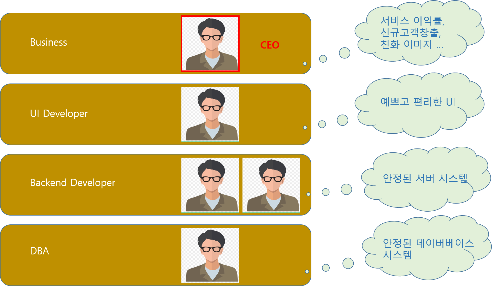


## TO-BE 조직 (Vertically-Aligned)

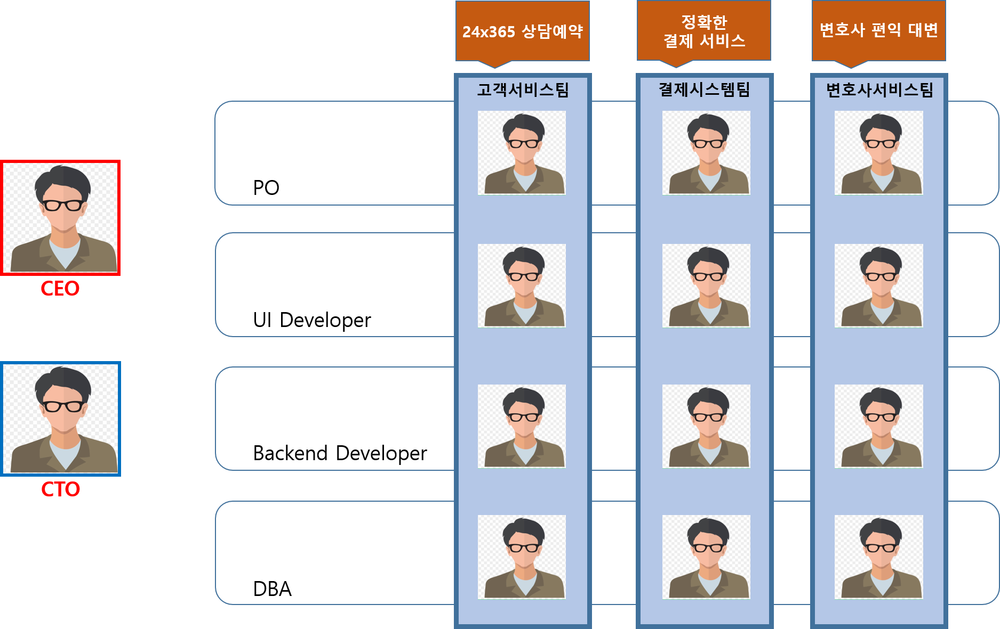

## 서비스 설계를 위한 Event Storming

- 다음과 같은 순서로 최종 모델을 도출하였음.
- **Event 도출 -> 부적격 Event 탈락 -> Actor/Commend 부착 -> Aggregate 묶기 -> Bounded Context 묶기 -> Policy 도출, 이동 -> Context Mapping -> 1차 모델 도출 -> 요구사항 검증 및 보완 -> 최종 모델**


### Events 도출
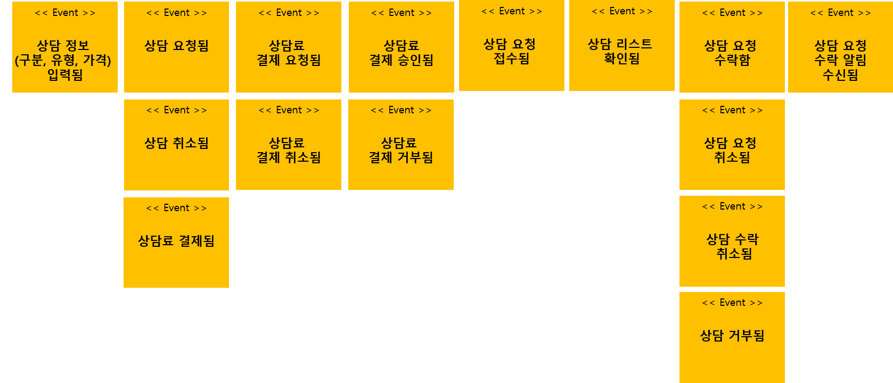


### 부적격 Event 탈락
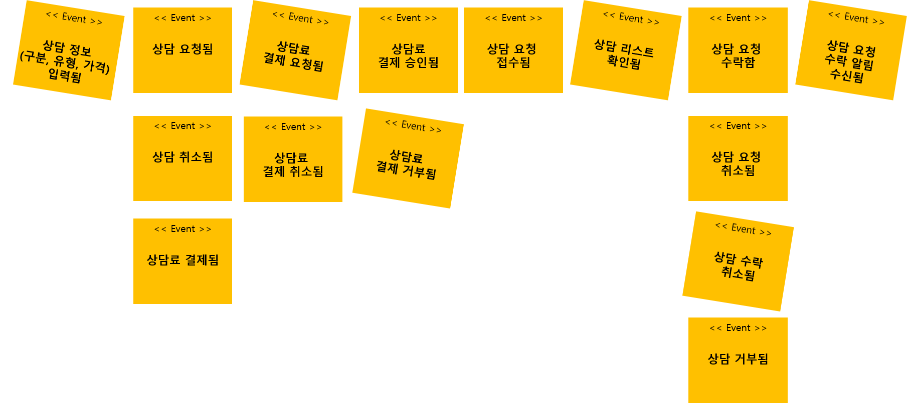

  
  과정 중 도출된 여러 이벤트 중 잘못되거나 프로젝트 범위에 맞지 않는 도메인 이벤트들을 걸러내는 작업을 수행함

    - UI의 이벤트/업무적인 이벤트 아니기 때문에 제외함: 상담정보입력됨, 결제요청됨, 상담리스트확인됨, 상담요청수락알림수신됨, 결제거부됨
    - 프로젝트 범위에 벗어난다고 판단하여 제외함: 상담수락취소됨
   	- 1차 필터링 되었으나, 이후 비즈니스 Needs에 따라 추가 가능한 후보군으로 분류함: 요청콜 접수됨, 결제지불됨, 콜거부됨


### Actor, Command 부착하여 가독성개선
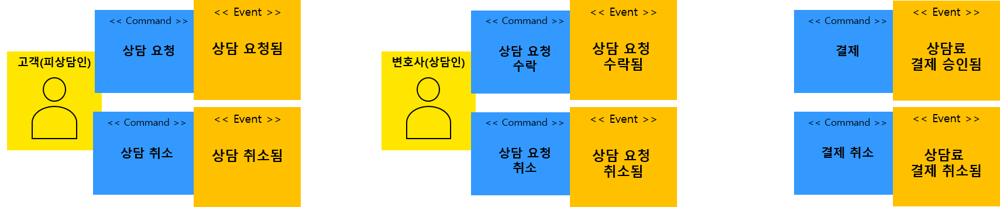


### Aggregate으로 묶기
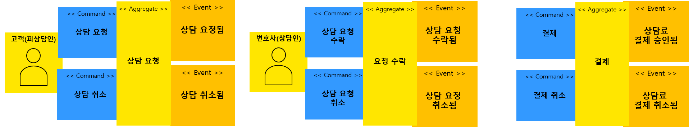

    - 대리요청, 결제, 요청수락 Aggregate을 생성하였고, 해당 Aggregate아 연결된 Commnad, event들에 의하여 트랜잭션이 유지되어야 하는 단위로 그룹핑함


### Bounded Context로 묶기
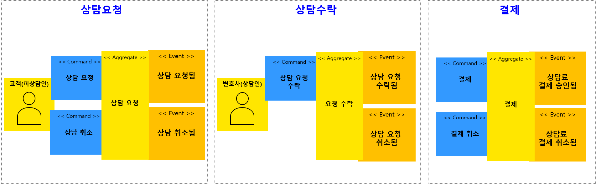

    - 도메인 서열 분리 
        - Core Domain: call(고객 App.), grab(대리기사 App.) - 없어서는 안될 핵심 서비스이며, 연견 Up-time SLA 수준을 99.999% 목표, 배포주기는 call 의 경우 1주일 1회 미만, grab 의 경우 1개월 1회 미만
        - Supporting Domain: 고객센터, 기사관리센터 - 경쟁력을 내기위한 서비스이며, SLA 수준은 연간 60% 이상 uptime 목표, 배포주기는 각 팀의 자율이나 표준 스프린트 주기가 1주일 이므로 1주일 1회 이상을 기준으로 함.
        - General Domain: 결제 - 결제서비스로 3rd Party 외부 서비스를 사용하는 것이 경쟁력이 높음


### Policy 부착
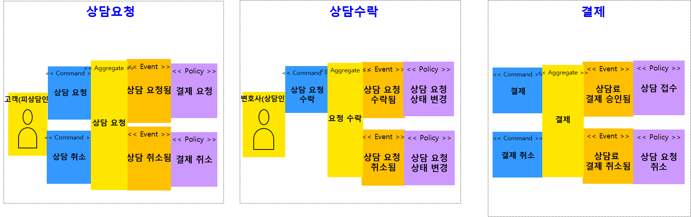


### Policy의 이동 / Context Mapping / 1차 Model
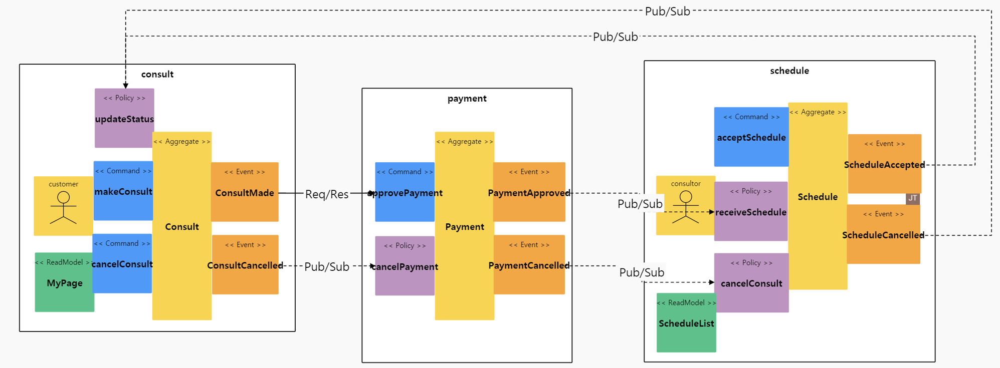

    - 컨텍스트 매핑하여 점선/실선으로 연결함.
    - 한글에서 영어로 변경함. 
    - 명사형/동사형 고려 이름 조정함 (grab --> Catcher), "Call" 과 같은 Reserved word 는 "Caller"로 변경함
    - caller 와 catcher 에 각각 View Model 추가


### 1차 Model에 대한 요구사항 검증 및 보완

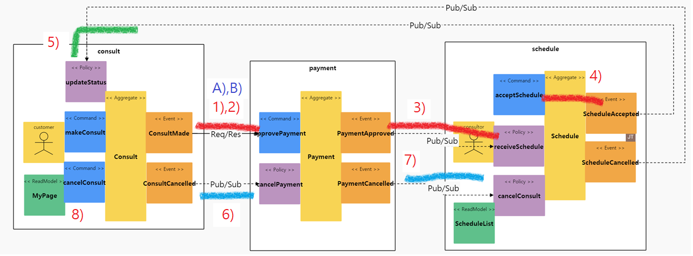

   	[기능적 요구사항]
    - 1) 고객이 APP에서 대리기사를 요청한다. (√)
   	- 2) 고객이 안내된 요금을 APP을 통해 미리 결제한다. (???) --> 콜요청과 결제요청 이벤트 분리에 대한 Need
  	- 3) 결제가 완료 되면 콜 요청 내역이 대리기사에게 전달된다. (√)
  	- 4) 대리기사에게 콜 정보가 도착하면 해당 콜을 수락한다. (√)  
  	- 6) 요청이 수락되면 승객은 APP에서 진행상태를 조회할 수 있다. (???)	
  	- 7) 고객이 중간에 요청을 취소할 수 있다. (√)
   	- 8) 요청이 취소되면 결제가 취소된다. (√)
  	- 9) 고객은 요청한 콜에 대한 모든 진행내역을 myPage를 통해 조회가능하다. (???)

    [비기능적 요구사항]
  	- A) 대리기사 관리 시스템에 장애가 발생하더라도 콜 요청은 상시 받을 수 있어야 한다. (√)  
  	- B) 콜 결제 시스템에 과부하 발생 시 요청을 잠시 보류하고, 잠시 후에 다시 하도록 유도한다. (√)  

### 최종 Model

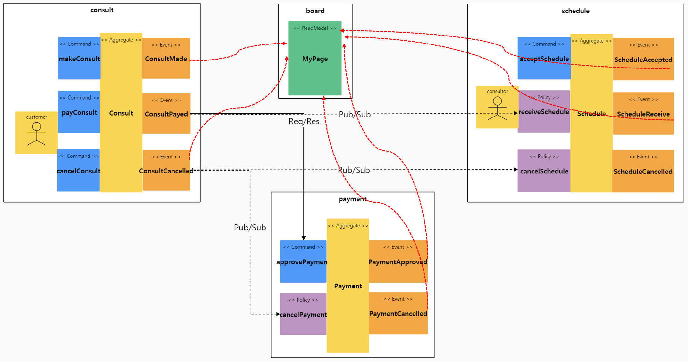

    - 모델 검증 및 보완과정을 거쳐, 콜요청 후 지불이 완료되어야만 요청이 전달될 수 있도록 하기위해 별도의 "CallPayed" 이벤트 추가하여 모델 수정
    - cancelCall은 call을 삭제하기 때문에 payCancelled 이벤트를 굳이 받을 필요가 없음
    - View Model을 CQRS 패턴을 적용하여 독립적인 마이크로 서비스로 추출
    - callID를 Key로 모든 히스토리 조회되도록 수정함


### 최종 Model (기능 추가)


    - 서비스 불능 지역일 경우 콜요청이 Deny되는 프로세스에 대해 SAGA 패턴 적용
    - catcher 서비스에서는 "receiveCall" 폴리시 및 기준정보에 따라, 수신된 콜에 대해 "CallReceived" 와 "CatchDenied" 2개의 이벤트가 추가 발생되도록 모델을 수정함.
    - catcher 서비스에서 Deny된 결과가 caller에서도 수신될 수 있게, caller 서비스에 "denyCall" 폴리시와 "CallDenied" 이벤트를 추가하여 수정함. 

  
## 헥사고날 아키텍처 다이어그램 도출

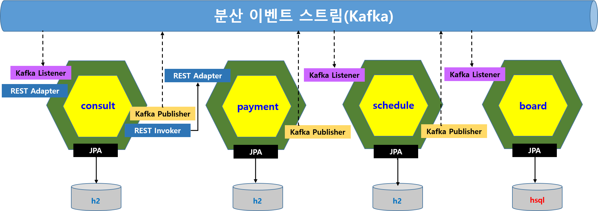

    - Chris Richardson, MSA Patterns 참고하여 Inbound adaptor와 Outbound adaptor를 구분함
    - 호출관계에서 PubSub 과 Req/Resp 를 구분함
    - 서브 도메인과 바운디드 컨텍스트의 분리:  각 팀의 KPI 별로 아래와 같이 관심 구현 스토리를 나눠가짐

   
   
# 구현:

분석/설계 단계에서 도출된 헥사고날 아키텍처에 따라, 각 BC별로 대변되는 마이크로 서비스들을 **Spring Boot**로 구현하였다.
구현한 각 서비스 로컬에서 실행하는 방법은 아래와 같다 (각자의 포트넘버는 위에서부터 8080 ~ 8084 이다)

```
cd gateway
mvn spring-boot:run

cd caller
mvn spring-boot:run  

cd payment
mvn spring-boot:run 

cd catcher
mvn spring-boot:run

cd dashboard
mvn spring-boot:run  
```
   
   
## DDD(Domain-Driven-Design) 의 적용
이벤트 스토밍의 결과로 도출된 Aggregate 단위로 Entity를 정의하였으며, 각 Domain 별 Entity는 다음과 같다. 
    - **caller(콜요청) / Payment(결제) / catcher(콜수락) / dashboard(고객/기사 페이지)**

각 Entity별 Repository에는 RepositoryRestResource Pattern 등을 적용하고, Getter/Setter 구현을 자동화하하기 위해 lombok을 사용하였다.
- Caller 서비스의 Caller.java
```java

@Entity
@Getter @Setter
public class Caller {
    @Id
    @GeneratedValue(strategy= GenerationType.AUTO)
    private Long callId;

    private String mobile;
    private String location;

    private PayType payType;
    private Integer payAmount;

    private CallerStatus status;
    private Long paymentId;

    // call 요청시 먼저 Payment 정보가 있어야 한다.
    @PrePersist
    public void onPrePersist() {
        System.out.println(" ### Caller.onPrePersist ###");

        if (this.payType == null ||
            this.payAmount == null ) {
           throw new InvalidParameterException("### FAILURE occurred in Caller saving : payType or payAmount is null. ###");
        }
        this.setStatus(CallerStatus.CREATED);
    }

    // call이 요청되면 CallMade 이벤트를 발생시킨다.
    @PostPersist
    public void onPostPersist() {

        System.out.println(" ### Caller.onPostPersist ###");

        CallMade callMade = new CallMade();
        BeanUtils.copyProperties(this, callMade);
        callMade.publishAfterCommit();

        System.out.println(" ### CallMade Event Created ###");
    }

    // call이 삭제되면서 CallCancelled 이벤트를 발생시킨다.
    @PostRemove
    public void onPostRemove() {
        System.out.println(" ### Caller.onPostRemove ###");

        CallCancelled callCancelled = new CallCancelled();
        BeanUtils.copyProperties(this, callCancelled);
        callCancelled.publishAfterCommit();

        System.out.println(" ### CallCancelled Event Created ###");
    }
}
```

**Entity Pattern** 과 **Repository Pattern** 을 적용하여 JPA 를 통하여 다양한 데이터소스 유형 (RDB or NoSQL) 에 대한 별도의 처리가 없도록
데이터 접근 어댑터를 자동 생성하기 위하여 **Spring Data REST** 의 RestRepository 를 적용하였다.
- Caller 서비스의 CallerRepository.java
```java
@RepositoryRestResource(collectionResourceRel="calls", path="calls")
public interface CallerRepository extends PagingAndSortingRepository<Caller, Long> {

}
```
   
다음은 REST API를 호출하여 정상적으로 동작되는지 확인한 결과이다.
- Caller 서비스에서 콜 요청    
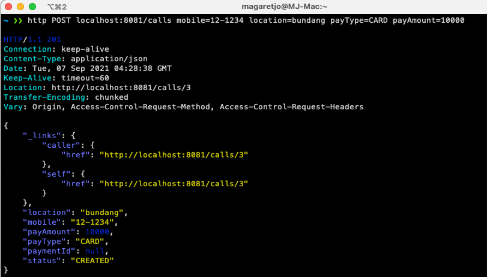

- Caller 서비스에서 콜 결제 요청   


- Payment 서비스에서 "결제상태" 확인   


- Cathcer 서비스에서 콜 접수 처리   


- 콜 요청 취소   
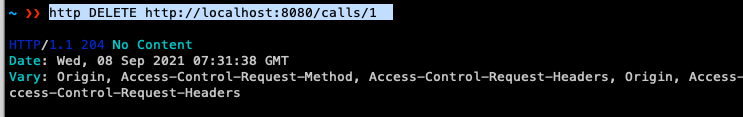

- kafka 이벤트 모니터링   

   
      
## 폴리글랏 퍼시스턴스

dashboard 서비스의 경우, H2DB를 사용한 다른 서비스들과 구별하기 위하여, hsqldb를 사용하였다.  
이를 위해 dashboard의 pom.xml에 dependency를 h2database에서 hsqldb로 변경 적용하였다.
이를 통해 MSA간 서로 다른 종류의 DB간에도 문제 없이 동작하여 다형성을 만족하는지 확인하였다. 

|서비스|DB|pom.xml|
| :--: | :--: | :--: |
|caller, payment, catcher| H2 |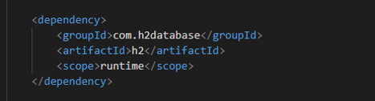|
|dashboard| hsql |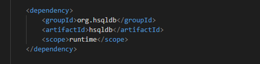|


## Gateway 적용

gateway > application.yml 설정

```yaml

spring:
  profiles: docker
  cloud:
    gateway:
      routes:
        - id: caller
          uri: http://caller:8081
          predicates:
            - Path=/calls/**
        - id: payment
          uri: http://payment:8082
          predicates:
            - Path=/payments/**
        - id: catcher
          uri: http://catcher:8083
          predicates:
            - Path=/catches/**
        - id: dashboard
          uri: http://dashboard:8084
          predicates:
            - Path= /dashboards/**
      globalcors:
        corsConfigurations:
          '[/**]':
            allowedOrigins:
              - "*"
            allowedMethods:
              - "*"
            allowedHeaders:
              - "*"
            allowCredentials: true

server:
  port: 8080
```

## gateway 테스트

gateway와 ingress를 통한 서버스 인바운드 연결 지원을 테스트 한다.

1. Gateway
- gateway의 External-IP를 확인 하여 로컬의 Host 파일에 적용


- gateway의 External-IP를 통해  Call 생성


- gateway의 URI를 통해  Call 확인


## 동기식 호출과 Fallback 처리
고객은 대리기사 호출을 위해 자신의 연락처,위치,지불방식 등을 입력한 후에 최종적으로 결제를 완료해야 한다.
결제가 완료되지 않으면 대리기사 호출을 할 수 없도록 FeginClient를 이용한 동기 호출 방식을 적용하였다. 

- Caller 서비스 내의 external.PaymentService 
```java
@FeignClient(name="payment", url="${api.url.payment}", fallback = PaymentServiceFallback.class)
public interface PaymentService {
    @RequestMapping(method= RequestMethod.GET, path="/payments/approve")
    public PaymentResult approve(@RequestBody HashMap<String, String> map);
}
```
- external.PaymentServiceFallback
```java
@Component
public class PaymentServiceFallback implements PaymentService {
    @Override
    public PaymentResult approve(@RequestBody HashMap<String, String> map) {
        // 에러코드(-2)와 메시지를 리턴한다.
        PaymentResult pr = new PaymentResult();
        pr.setResultCode(-2L);
        pr.setResultMessage("### Circuit Breaker has been opened. Fallback returned instead ###");

        return pr;
    }
}
``` 
   

- 실제 Payment 마이크로서비스에 구현되어 있는 REST API
```java
    @RequestMapping(value = "/payments/approve",
            method = RequestMethod.GET,
            produces = "application/json;charset=UTF-8")
    public PaymentResult approve(@RequestBody HashMap<String, String> map) {
    
        PaymentResult pr = new PaymentResult();
        try {
            String callId    = this.getParam(map, "callId", true);
            String payType   = this.getParam(map, "payType", true);
            String payAmount = this.getParam(map, "payAmount", false);
            String mobile    = this.getParam(map, "mobile", true);
    
            // approve 내에서 금액이 5000원 미만이면 에러가 발생
            Payment payment = Payment.approve(
                PayType.valueOf(payType),
                Integer.valueOf(payAmount),
                Long.valueOf(callId)
                );
            paymentRepository.save(payment);
    
            pr.setResultCode(1L);
            pr.setResultMessage(String.valueOf(payment.getPaymentId()));
            return pr;
    
        } catch (Exception e) {
            pr.setResultCode(-1L);  // 에러코드 및 메시지 리턴
            pr.setResultMessage(e.getMessage());
            return pr;
    }
```
   

- Caller 서비스에서 PaymentService를 동기 방식으로 호출
```java
    @PostMapping("/calls/payCall/{callId}")
    public void payCall(@PathVariable Long callId) throws Exception {
        Optional<Caller> caller = callerRepository.findById(callId);
        ...
        HashMap<String, String > map = new HashMap<String, String>();
        map.put("callId",    String.valueOf(theCaller.getCallId()));
        map.put("mobile",    theCaller.getMobile());
        map.put("payType",   String.valueOf(theCaller.getPayType()));
        map.put("payAmount", String.valueOf(theCaller.getPayAmount()));

        // PaymentService에게 승인을 요청한다.
        // PaymentService 호출에 실패할 경우 -2를 리턴받고,
        // PaymetService 자체에서 오류가 날 경우 -1을 리턴한다.
        PaymentResult pr = CallerApplication.applicationContext.getBean(
                            nicecall.external.PaymentService.class)
        .approve(map);

        System.out.println("### PaymentService.process() returns : " + pr);

        // Payment 호출에 실패하거나 응답이 지연된 경우
        if (pr.getResultCode().equals(-2L)) {
            throw new PaymentException("<<< PaymentService : No-Response or Timed-out. please, try later... >>>");
        // Payment 내부 에러인 경우    
        } else if (pr.getResultCode().equals(-1L)) {
            throw new PaymentException("<<< PaymentService : 결제 처리에 실패하였습니다. :: " + pr.getResultMessage() + " >>>");
        } else {
            // 성공할 경우 ResultCode가 paymentId이다.
            theCaller.setStatus(CallerStatus.APPROVED);
            theCaller.setPaymentId(pr.getResultCode());
            callerRepository.save(theCaller);
        }
```

- Payment가 승인 거부시 Caller는 리턴받은 결과를 다음과 같이 보여준다.
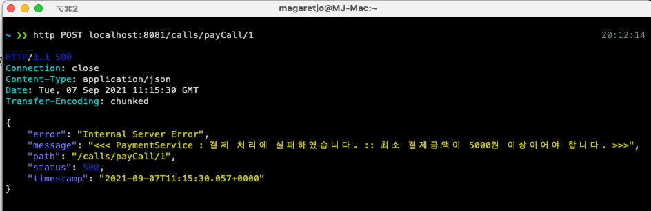

- Payment 응답이 느려질 경우, Fallback에 의해 다음과 같이 나타난다.
  
     
   
## 비동기식 호출 / 시간적 디커플링 / 장애격리 / 최종 (Eventual) 일관성
본 시스템에 적용되어 있는 주요 비동기 호출은 다음과 같다.
```
  • Call 결제시, Catcher에게 알려줌 (CallPayed --> receiveCall)
  • 결제된 Call 취소시, Payment에서도 취소되도록 하며 (CallCancelled --> cancelPayment)
  • Catcher에게도 Call이 취소된 상태임을 알려준다. (CallCancelled --> cancelCatch)
  • Catcher가 서비스 불능 지역으로 접수 안될 경우 Payment에게  알려준다. (CatchDenied --> disablePayment)
```
그 외에도 각 마이크로서비스에서 콜이 처리되는 상태를 알 수 있도록 Dashboard 서비스에게 이벤트를 전달하여 모든 기록이 남도록 한다.
```  	
  • Caller : CallMade, CallPayed, CallCancelled
  • Payment : PaymentApproved,PaymentCancelled, PaymentDisabled
  • Catcher : CallReceived, CallCaught, CatchDenied 
```
이를 위해 각각의 마이크로서비스에 이벤트를 수신 처리하는 PolicyHandler를 구현하였다.

- Dashboard의 PolicyHandler 
```java
   // 대시보드를 생성한다.
    @StreamListener(KafkaProcessor.INPUT)
    public void wheneverCallMade_inputRecord(@Payload CallMade callMade){
        if(!callMade.validate()) return;

        String extraIdName = "";
        Long   extraIdValue = null;
        String description = " mobile=" + callMade.getMobile() +
                            ", location=" + callMade.getLocation() +
                            ", payType=" + callMade.getPayType() +
                            ", payAmount=" + callMade.getPayAmount() ;
        inputRecord(callMade, extraIdName, extraIdValue, description);
    }
    ...

    // 콜 접수 대시보드 생성
    @StreamListener(KafkaProcessor.INPUT)
    public void wheneverCallReceived_inputRecord(@Payload CallReceived callReceived){
        if(!callReceived.validate()) return;

        String extraIdName = "";
        Long   extraIdValue = null;
        String description = " mobile=" + callReceived.getMobile() +
                ", location=" + callReceived.getLocation() + " : 콜 접수 대기중입니다. ";
        inputRecord(callReceived, extraIdName, extraIdValue, description);
    }

    // 콜 거절 대시보드 생성
    @StreamListener(KafkaProcessor.INPUT)
    public void wheneverCatchDenied_inputRecord(@Payload CatchDenied catchDenied){
        if(!catchDenied.validate()) return;

        String extraIdName = "";
        Long   extraIdValue = null;
        String description = " mobile=" + catchDenied.getMobile() +
                ", location=" + catchDenied.getLocation() + " : 서비스 불가 지역입니다."  ;
        inputRecord(catchDenied, extraIdName, extraIdValue, description);
    }

    ...

 ```
 
위와 같은 비동기 방식으로 콜요청 및 결제시스템과 대리기사용 Catcher 시스템이 분리되어 있기 때문에 잠시 Catcher시스템에 장애가 있더라도 Catcher 시스템을 재기동한 후, 요청된 콜을 확인할 수 있다.
1) catcher가 가동되지 않은 상태에서 콜 결제를 처리한다. 
   
_(catcher가 없어도 콜 요청 및 결제가 실행된다.)_

1) catcher가 가동되면서 밀려있는 콜을 수신한다.
   
_(catcher 서비스가 수행된 후 대기중인 콜 요청을 수신한다.)_
   
   
## SAGA / Correlation
요청된 콜에 대해 결제가 완료되면 Catcher에게 해당 요청이 전달되는데, 만약 서비스 불가 지역이라면 해당 요청은 거절된 상태(CatchDenied)가 되며, Caller와 Payment 서비스에게도 각각 해당 콜이 불능 상태가 되었음을 알린다.
이를 위해 Caller의 callerID를 각 마이크로서비스에 전달하여, 이벤트 처리시 main key로 사용되도록 하였다. 

1) Caller 서비스는 결제 완료 후, Catcher에게 결제가 완료되었다는 이벤트를 보낸다.
```java
    @PostUpdate
    public void onPostUpdate() {

        if (this.getStatus() != CallerStatus.APPROVED) return;

        if (this.getStatus() == CallerStatus.APPROVED) {
            CallPayed callPayed = new CallPayed();
            BeanUtils.copyProperties(this, callPayed);
            callPayed.publishAfterCommit();

            log.info(" ### CallPayed Event Created ###");
        }
    }
```
2) Catcher는 전달받은 이벤트의 callId를 correlation 키로 사용하며, 다시 CatchDenied 이벤트를 발생시킨다.
```java
    // Catcher의 PolicyHandler
    @StreamListener(KafkaProcessor.INPUT)
    public void wheneverCallPayed_receiveCall(@Payload CallPayed callPayed){
        if(!callPayed.validate()) return;
    
        Optional<Catcher> optionalCatcher = catcherRepository.findByCallId(callPayed.getCallId());
    
        if (optionalCatcher.isPresent()) {
            throw new IllegalStateException("<<< 이미 접수된 콜 정보입니다 : >>>" );
        } 
        Catcher catcher = new Catcher();
        catcher.setCallId(callPayed.getCallId());   // callId를 키값으로 보관
        catcher.setMobile(callPayed.getMobile());
        catcher.setLocation(callPayed.getLocation());
    
        String location = catcher.getLocation();
        if (!outOfService(location)) {              // 서비스 불가능 지역이면 DENY 처리
            catcher.setCatchStatus(CatchStatus.RECEIVED);
        } else {
            catcher.setCatchStatus(CatchStatus.DENIED);
        }
        catcherRepository.save(catcher);
    }
        ...
    // Catcher Entity 저장시 CatchDenied 이벤트 발생
    @PostPersist
    public void onPostPersist() {
        System.out.println(" ### Catcher.onPostPersist ###");

        if (this.getCatchStatus() == CatchStatus.RECEIVED) {
            ...
        } else if (this.getCatchStatus() == CatchStatus.DENIED) {
            System.out.println(" ### 서비스 불가 지역입니다. ###");
            CatchDenied catchDenied = new CatchDenied();
            BeanUtils.copyProperties(this, catchDenied);
            catchDenied.publishAfterCommit();
        }
    }
```
3) Payment는 CatchDenied가 수신되면 Payment 상태를 불능 상태로 바꾸어 버린다.
```java
    @StreamListener(KafkaProcessor.INPUT)
    public void wheneverCatchDenied_disablePayment(@Payload CatchDenied catchDenied){
        if(!catchDenied.validate()) return;

        Optional<Payment> payment = paymentRepository.findByCallId(catchDenied.getCallId());

        if(!payment.isPresent()) return;

        Payment thePayment = payment.get();
        thePayment.setStatus(PaymentStatus.DISABLED);

        paymentRepository.save(thePayment);

    }
```
4) Caller에게도 콜요청이 거부되었음을 알려준다.
```java
    @StreamListener(KafkaProcessor.INPUT)
    public void wheneverCatchDenied_updateStatus(@Payload CatchDenied catchDenied){
        if(!catchDenied.validate()) return;

        log.info("\n\n##### listener Dashboard catchDenied : " + catchDenied.toJson() + "\n\n");

        Long callId = Long.valueOf(catchDenied.getCallId());
        Optional<Caller> caller = callerRepository.findById(callId);

        if (!caller.isPresent()) {
            throw new InvalidParameterException("<<< 대상 콜을 찾을 수 없습니다 (Wrong callerId : " + catchDenied.getCallId() + " ) >>> ");
        }
        Caller theCaller = caller.get();

        theCaller.setStatus(CallerStatus.DENIED);
        callerRepository.save(theCaller);

    }
```
   
아래는 SAGA 패턴이 적용되어 정상적으로 요청되었던 콜이 Catcher에 의해 처리되는 동안 발생되는 이벤트를 보여준다.   
   
   
## CQRS 구현
복잡한 비즈니스 로직과 트랜잭션 처리를 해야 하는 Caller,Payment,Catcher 서비스와 다르게 단순 조회만을 위주로 하는 Dashboard 서비스는 CQRS 패턴을 적용하여 단순 조회만을 처리한다.   


   
   
   

# 배포 및 운영:

## CI/CD 설정
### 도커 이미지 및 컨테이너 배포   
각 마이크로 서비스별로 build 후에 docker 이미지를 azure 레지스트리에 올린다. 
- **Build 및 Dockerizing** 
```shell
# 프로젝트 디렉토리에서 시작
cd caller
mvn package -Dmaven.test.skip=true
docker build -t nicecall.azurecr.io/caller:latest .
docker push nicecall.azurecr.io/caller:latest 

cd ../catcher
mvn package -Dmaven.test.skip=true
az acr login --name nicecall
docker build -t nicecall.azurecr.io/catcher:latest .
docker push nicecall.azurecr.io/catcher:latest 
...
```
_위와 같은 방식으로 나머지 마이크로서비스 프로젝트에 대해서도 수행한다._
   
- **namespace 및 deboloyment, service 생성**
```shell
# namespace 생성
kubectl create namespace nicecall
kubectl config set-context --current --namespace=nicecall

# caller deployment, service 생성
kubectl apply -f ../caller/azure/deploy.yaml
kubectl apply -f ../caller/azure/service.yaml

# catcher deployment, service 생성
kubectl apply -f ../catcher/azure/deploy.yaml
kubectl apply -f ../catcher/azure/service.yaml
..
```
_(위와 같은 방식으로 나머지 마이크로서비스 프로젝트에 대해서도 수행한다.)_
   
      
각 마이크로서비스에 Deployment, Service생성에 사용된 yaml 파일은 아래와 같다. 
- Deployment.yaml
```yaml
apiVersion : apps/v1
kind: Deployment
metadata:
  name: caller
  namespace: nicecall
  labels:
    app: caller
spec:
  replicas: 1
  selector:
    matchLabels:
      app: caller
  template:
    metadata:
      labels:
        app: caller
    spec:
      containers:
        - name: caller
          image: nicecall.azurecr.io/caller:latest
          ports:
            - containerPort: 8080
```
_(참고로 위의 yaml 파일은 가장 기본적인 형태이다.(각 마이크로서비스 특성에 따라 다른 속성이 추가된다.)_
   
   
   
_(각 마이크로서비스 컨테이너가 cloud에서 생성되고 있는 모습)_
  
- Service.yaml
```yaml
apiVersion: v1
kind: Service
metadata:
  name: caller
  namespace: nicecall
  labels:
    app: caller
spec:
  ports:
    - port: 8080
      targetPort: 8080
  selector:
    app: caller
```


_(각 마이크로서비스가 cloud에 running 된 모습)_
   

### 자동화된 DevOps Pipeline 적용 
서비스가 안정되면 Azure Cloud DevOps를 활용하여 다음과 같이 Pipeline을 작성하여 CI/CD를 자동화한다.
- caller 마이크로서비스에 대해 CI/CD Pipeline 생성한 모습
  
   

- Step1. Github에 변경사항 push 한다.

- Step2. DevOps CI pipeline이 실행됨


- Step3. DevOps CD pipeline이 start됨


- Step4. Caller 서비스가 cloud에서 실행되는 모습
  
   
   
## ConfigMap 적용
변경 가능성이 높은 속성 정보에 대해서는 다음과 같이 ConfigMap을 적용하여 구현하였다.
1) 대리운전 서비스 불가 지역에 대해 소스코드내에 다음과 같이 application 속성 값을 받아들이도록 지정
```java
        ...
    
    @Value("${catcher.service.area}")
    String svcAreas;
    // 전달받은 요청이 서비스 지역에 포함되어 있는지 검증한다.
    private Boolean outOfService(String location) {

        System.out.println(" CATCHER SERVICE AREA : " + svcAreas);
        String [] arrSvcArea = svcAreas.split(",");

        for (int i = 0; i < arrSvcArea.length ; i++) {
            String s = arrSvcArea[i].toLowerCase();

            // 서비스 지역이면 false 리턴
            if (s.equals(location.toLowerCase())) return false;

        }
        return true;
    }
```
1) application.yml 파일 내부에서는 환경 변수를 통해 전달받도록 설정 
```yaml
# application.yml
catcher:
  service:
    area: ${catcher-area}   # 환경 변수
```

1) deployment 내부에서는 catcher-area 환경변수의 값에 대하여  catcher-cm이라는 configMap을 참조시킴
```yaml
# deploy.yaml
env:
  - name: catcher-area
    valueFrom:
      configMapKeyRef:
        name: catcher-cm
        key: area
```
4) 최종적으로 configMap 안에 다음과 같이 고정 값을 넣어두고 쉽게 수정할 수 있도록 구현함
```yaml
# catch-cm.yaml
apiVersion: v1
kind: ConfigMap
metadata:
  name: catcher-cm
  namespace: nicecall
data:
  area: kangnam,dongjak,nowon,mapo,jongro,bundang
```
이와 같이 configMap에 설정된 값이 적용되어, 서비스 가용 지역이 아닌 콜이 수신될 경우 Catcher에 에 의해 거부 처리되는 모습을 아래와 같이 확인할 수 있다.   
    
   
## Persistence Volume
nicecall-pvc.yaml 파일을 이용하여 persistanceVolumn 선언하였다.
```yaml
# nicecall-pvc.yaml
apiVersion: v1
kind: PersistentVolumeClaim
metadata:
  name: nicecall-disk
  namespace: nicecall
spec:
  accessModes:
    - ReadWriteMany
  storageClassName: azurefile
  resources:
    requests:
      storage: 1Gi
```
선언된 디스크 사용을 위해 caller와 catcher의 deploy.yaml에 Volumn 및 Mount 정보는 다음과 추가한다. 
```yaml
# deploy.yaml
volumeMounts:
  - mountPath: "/mnt/azure"
    name: volume
volumes:
  - name: volume
    persistentVolumeClaim:
      claimName: nicecall-disk
```
application.yml에는 해당 볼륨에 사용할 경로를 지정한다.(caller의 설정 내용)
```yaml
# application.yml
logging:
  level:
    root: info
  file: /mnt/azure/logs/caller.log
```
_(위와 같이 catcher의 설정 파일에도 로그 파일 위치를 지정)_

해당 로그 파일이 계속 누적하여 쌓이고 있는지는 다음과 같이 확인한다.

 
  
----
## 동기식 호출 / 서킷 브레이킹 / 장애격리
서킷 브레이커는 Spring FeignClient + Hystrix 를 적용하여 구현하였다.  

동기호출 방식의 콜 결제(Caller --> Payment) 부분은 Feign Client와 Fallback을 적용하여 구현하였음을 이미 위에서 제시하였다.   
본 시나리오에서는 hystrix를 통해 timeout 임계값을 설정하고 부하가 발생할 경우 어떻게 Circuit Break가 작동되는지를 확인한다. 

- Hystrix 테스트를 위해 callId=999의 조건의 경우 0.8~1.2초 정도 sleep이 발생하도록 Payment Service 내부에 다음과 같이 로직을 삽입하였다. 
```java
    @RequestMapping(value = "/payments/approve",
            method = RequestMethod.POST,
            produces = "application/json;charset=UTF-8")
    public PaymentResult approve(@RequestBody HashMap<String, String> map) {

        PaymentResult pr = new PaymentResult();
        try {
            String callId    = this.getParam(map, "callId", true);

            // Circuit break 테스트를 위해 일부러 sleep을 발생시킨다.
            if (callId.equals ("999")) {
                System.out.println("<<<<< --- SLEEPING (1±0.2 seconds) for Hystrix Test --- >>>>> ");
                Thread.sleep((long) (800 + Math.random() * 400));
                ...
            }
```
   
- 다음은 Payment를 호출하는 Caller 서비스의 설정 파일에 timeout 임계값을 1.5초로 설정한다.
```yml
# application.yml (Caller 서비스)
feign:
  hystrix:
    enabled: true
hystrix:
  command:
    default:
      execution.isolation.thread.timeoutInMilliseconds: 1500
      circuitBreaker.requestVolumeThreshold: 1

```
   
- 이제 siege 툴을 사용하여 부하를 줄 경우 어떻게 CB가 작동되는지 확한다.
  
```shell
# (1) 5명 동시 사용자로, 10초 동안 부하를 발생시킨 경우
siege -c5 -t10S -v 'http://localhost:8081/calls/payCall/999'
```
  
_(Availability가 100%로, 서비스 응답시 1.2초의 sleep이 발생하더라도 임게값이 1.5초이기 때문에 CB가 작동되지 않는다.)_


```shell
# (2) 30명 동시 사용자로, 10초 동안 부하를 발생시킨 경우
siege -c30 -t10S -v 'http://localhost:8081/calls/payCall/999'
```

_(Availability가 현저하게 낮아지며, CB가 발동되어 에러를 리턴하였다.)_
   

## 오토스케일 아웃 (HPA)

- 앞서 CB 는 시스템을 안정되게 운영할 수 있게 해줬지만 사용자의 요청을 100% 받아들여주지 못했기 때문에 이에 대한 보완책으로 자동화된 확장 기능을 적용하고자 한다. 

- 콜요청(caller) 서비스에 대한 replica 를 동적으로 늘려주도록 HPA 를 설정한다. 설정은 CPU 사용량이 15프로를 넘어서면 replica 를 10개까지 늘려준다.

- 기 배포된 deployment의 Resources의 설정값이 높아 아래 내용으로 변경
```yaml
    resources:
      requests:
        memory: "64Mi"
        cpu: "100m"
      limits:
        memory: "500Mi"
        cpu: "200m"
```
- HPA 설정 값 확인 및 HPA 배포
```
 - cpu-percent=15
 - Min Pod : 1
 - Max Pod : 10
```
```shell
kubectl autoscale deployment caller --cpu-percent=15 --min=1 --max=10 -n nicecall
```


- Siege를 이용해 부하 발생   


- 부하 발생 후 Pod 상태 확인


HPA 설정에 의해 Pod가 10까지 늘어난것을 확인

## Zero-downtime Deploy (Readiness Probe) 

* 먼저 무정지 재배포가 100% 되는 것인지 확인하기 위해서 Autoscaler 이나 CB 설정을 제거함.
- Readiness 미적용 yaml확인
```yaml
# deploy-readiness-v2.yaml
apiVersion : apps/v1
kind: Deployment
metadata:
  name: catcher
  namespace: nicecall
  labels:
    app: catcher
spec:
  replicas: 1
  selector:
    matchLabels:
      app: catcher
  template:
    metadata:
      labels:
        app: catcher
    spec:
      containers:
        - name: catcher
          image: kubecal262.azurecr.io/nicecall-catcher:v0.2
          ports:
            - containerPort: 8080
          env:
            - name: catcher-area
              valueFrom:
                configMapKeyRef:
                  name: catcher-cm
                  key: area
          resources:
            requests:
              memory: "64Mi"
              cpu: "200m"
            limits:
              memory: "500Mi"
              cpu: "500m"
          volumeMounts:
            - mountPath: "/mnt/azure"
              name: volume
      volumes:
        - name: volume
          persistentVolumeClaim:
            claimName: nicecall-disk
```

- Readiness 적용 deployment 배포
```shell
kubectl apply -f deploy-readiness-v2.yaml
```

- Readiness 미적용 배포에 대한 siege 워크로드 모니터링   


- Readiness 적용 yaml확인
```yaml
# deploy-readiness-v3.yaml
apiVersion : apps/v1
kind: Deployment
metadata:
  name: catcher
  namespace: nicecall
  labels:
    app: catcher
spec:
  replicas: 1
  selector:
    matchLabels:
      app: catcher
  template:
    metadata:
      labels:
        app: catcher
    spec:
      containers:
        - name: catcher
          image: kubecal262.azurecr.io/nicecall-catcher:v0.3
          ports:
            - containerPort: 8080
          env:
            - name: catcher-area
              valueFrom:
                configMapKeyRef:
                  name: catcher-cm
                  key: area
          readinessProbe:
            httpGet:
              path: '/actuator/health'
              port: 8080
            initialDelaySeconds: 90
            timeoutSeconds: 2
            periodSeconds: 5
            failureThreshold: 10
          resources:
            requests:
              memory: "64Mi"
              cpu: "200m"
            limits:
              memory: "500Mi"
              cpu: "500m"
          volumeMounts:
            - mountPath: "/mnt/azure"
              name: volume
      volumes:
        - name: volume
          persistentVolumeClaim:
            claimName: nicecall-disk
```

- Readiness 적용 deployment 배포
```shell
kubectl apply -f deploy-readiness-v3.yaml
```

- siege 워크로드로 부하 발생 및 모니터링   


Readiness 적용 deployment 배포 시 서비스 중단 없이 운영되는것을 확인

## Self-healing (Liveness Probe)

Liveness Probe의 기능인 Pod 상태 체크 후 Pod가 비정상적인 경우 자동 재시작 하는 기능을 확인한다.
- Liveness Probe 적용 yaml 확인
```yaml
# deploy-liveness.yaml
apiVersion : apps/v1
kind: Deployment
metadata:
  name: catcher
  namespace: nicecall
  labels:
    app: catcher
spec:
  replicas: 1
  selector:
    matchLabels:
      app: catcher
  template:
    metadata:
      labels:
        app: catcher
    spec:
      containers:
        - name: catcher
          image: kubecal262.azurecr.io/nicecall-catcher:v0.1
          ports:
            - containerPort: 8080
          env:
            - name: catcher-area
              valueFrom:
                configMapKeyRef:
                  name: catcher-cm
                  key: area
          livenessProbe:
            httpGet:
              path: '/actuator/health'
              port: 8080
            initialDelaySeconds: 120
            timeoutSeconds: 2
            periodSeconds: 5
            failureThreshold: 3
          resources:
            requests:
              memory: "64Mi"
              cpu: "200m"
            limits:
              memory: "500Mi"
              cpu: "500m"
          volumeMounts:
            - mountPath: "/mnt/azure"
              name: volume
      volumes:
        - name: volume
          persistentVolumeClaim:
            claimName: nicecall-disk
```

- 테스트 대상 Pod 상태 확인


- 대상 Pod의 상태를 불능(Down)으로 변경


- Pod의 상태 변경 사항 확인 - Restarts 변경됨


- Pod Event 확인


테스트를 통해 liveness Probe가 적용된 경우 Pod의 상태가 불능일 경우 재시작 됨을 확인
