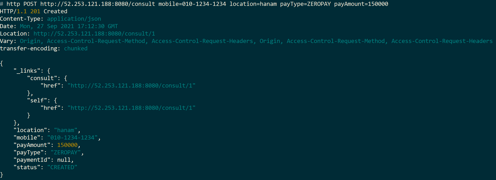

Repositories
- <b>상담관리</b>    - https://github.com/JayTHun/consult.git
- <b>일정관리</b>    - https://github.com/JayTHun/schedule.git
- <b>마이페이지</b>  - https://github.com/JayTHun/board.git
- <b>게이트웨이</b>  - https://github.com/JayTHun/gateway.git
- <b>결제관리</b>    - https://github.com/JayTHun/payment.git
# Consult-Lawer (법률 상담 서비스)

# Table of contents

- [법률 상담 (talk-Lawer) 서비스]
  - [서비스 시나리오](#서비스-시나리오)
    - 요구사항
  - [체크포인트](#체크포인트)
  - [분석/설계](#분석설계)
    - 개요 및 구성 목표
    - 서비스 설계를 위한 Event Storming
    - 헥사고날 아키텍처 다이어그램 도출
  - [구현방안 및 검증](#구현)
    - [DDD 의 적용](#ddddomain-driven-design-의-적용)
    - [CQRS 구현](#cqrs-구현)
    - [Polyglot Persistence](#Polyglot-Persistence)
    - [SAGA / Correlation](#saga--correlation)
    - [동기식 호출 과 Fallback 처리](#동기식-호출과-fallback-처리)
    - [비동기식 호출 / 시간적 디커플링 / 장애격리 / 최종(Eventual) 일관성](#비동기식-호출--시간적-디커플링--장애격리--최종-eventual-일관성)
  - [베포 및 운영](#배포-및-운영)
    - [CI/CD 설정](#cicd-설정)
    - [동기식 호출 / 서킷 브레이킹 / 장애격리](#동기식-호출--서킷-브레이킹--장애격리)
    - [오토스케일 아웃](#오토스케일-아웃-hpa)
    - [무정지 재배포](#zero-downtime-deploy-readiness-probe)
    - [항상성 유지](#self-healing-liveness-probe)


# 서비스 시나리오


## 요구사항

- 기능적 요구사항
 1. 사용자(고객, 피상담원)는 APP(or 웹페이지)에서 상담을 요청한다.   
 2. 사용자는 선택한 상담유형에 따라 안내된 수수료(상담료)를 미리 결제한다.
 3. 결제가 완료되면, 상담 요청이 상담원(‘변호사’)에게 전달된다.
 4. 상담원은 상담 요청 정보가 도착하면, 상담을 수락한다. 
 5. 상담 요청이 수락되면 사용자는 APP(or 웹페이지)에서 진행상태를 조회할 수 있다.
 6. 사용자의 변심으로 상담 요청을 취소할 수 있다.
   6-1. 상담이 불가한 지역인 경우, 자동으로 거부될 수도 있다.
 7. 상담 요청이 취소되면 결제는 취소된다.
 8. 사용자는 요청한 상담 건에 대한 진행 내역을 myPage를 통해서 조회 가능하다.(CQRS)


- 비기능적 요구사항

 1. 트랜잭션
 
    - 상담료가 결제가 되지 않는 경우, 상담 요청이 되지않아야 한다. 
    - 상담 요청이 취소되면 결제가 취소되고,  상담 요청 정보 또한 업데이트가 되어야 한다.
    - 사용자의 상담 요청이 거부된 경우, 자동으로 상담 요청 취소되고,상담료 결제가 취소되고,상담 요청 정보가 업데이트가 되어야 한다.
    
  
 2. 장애격리
 
    - 상담 요청은 24시간 가능해야 한다.
    - 결제 시스템에 과부하 발생 시, 잠시 후에 다시 하도록 유도한다.


# 체크포인트


## 평가항목
 1. Saga
 2. CQRS
 3. Correlation
 4. Req/Resp
 5. Gateway
 6. Deploy/Pipeline
 7. Circuit Breaker
 8. Autoscale (HPA)
 9. Zero-downtime deploy (Readiness Probe)
 10. Config Map/Persistence Volume
 11. Polyglot
 12. Self-healing (Liveness Probe)


# 분석/설계:


## AS-IS 조직 (Horizontally-Aligned)


## TO-BE 조직 (Vertically-Aligned)


## 서비스 설계를 위한 Event Storming

- **Event 도출 -> 부적격 Event 탈락 -> Actor/Commend 부착 -> Aggregate 묶기 -> Bounded Context 묶기 -> Policy 도출, 이동 -> Context Mapping -> 1차 모델 도출 -> 요구사항 검증 및 보완 -> 최종 모델**


### Events 도출


### 부적격 Event 탈락


  
  과정 중 도출된 여러 이벤트 중 잘못되거나 프로젝트 범위에 맞지 않는 도메인 이벤트들을 걸러내는 작업을 수행함

    - 상담정보(구분,유형,가격)입력됨, 상담료 결제요청됨, 상담료 결제거부됨, 상담리스트 확인됨, 상담수락 취소됨, 상담요청수락알림수신됨

### Actor, Command 부착하여 가독성개선


    - Event를 발생시키는 Command와 Command를 발생시키는주체, 담당자 또는 시스템을 식별함
    - Actor : 고객(피상담임), 변호사(상담인), 결제시스템(표시하진않음)
    - Command : 상담 요청/취소, 상담요청 수락/취소, 결제, 결제취소


### Aggregate으로 묶기


    - 연관있는 도메인 이벤트들을 Aggregate 로 묶었음 
    - Aggregate : 상담요청, 요청수락, 결제    


### Bounded Context로 묶기


### Policy 부착


### Policy의 이동 / Context Mapping / 1차 Model


    - 컨텍스트 매핑, 서비스 특성을 고려하여 이름 변경 및 영문 전환
    - 각 Actor가 확인하는 MyPage(view) 추가


### 1차 Model에 대한 시나리오 체크


####  기능적 요구사항 Coverage Check
  1) 사용자(고객, 피상담원)는 APP(or 웹페이지)에서 상담을 요청한다.
  2) <u>*사용자는 선택한 상담유형에 따라 안내된 수수료(상담료)를 미리 결제한다.*</u>
  3) 결제가 완료되면, 상담 요청이 상담원(변호사)에게 전달된다.
  4) 상담원은 상담 요청 정보가 도착하면, 상담을 수락한다.
  5) <u>*상담 요청이 수락되면 사용자는 APP(or 웹페이지)에서 진행상태를 조회할 수 있다.*</u> 
  6) 사용자의 변심으로 상담 요청을 취소할 수 있다.
  7) 상담 요청이 취소되면 결제는 취소된다.
  8) <u>*사용자는 요청한 상담 건에 대한 진행 내역을 myPage를 통해서 조회 가능하다.*</u>

####  비기능적 요구사항 Coverage Check
  A) 장애와 무관하게 상담 요청은 24시간 가능해야 한다.
  B) 결제 시스템에 과부하 발생 시, 잠시 후에 다시 하도록 유도한다.  

### 최종 Model


   
### 최종 Model (기능 추가)


    - 이벤트 분리 (ConsultMade->ConsultMade, ConsultPayed) 및 이벤트 추가(ScheduleReceived)
    - 법률상담시스템에서 미리 정한 상담가능지역 외에는 상담이 자동거절 및 결제취소되도록 하는 시나리오('6-1') 추가, 관련 폴리시(denyConsult)와 이벤트 추가(consultDenied, scheduleDenied)
      
## 헥사고날 아키텍처 다이어그램 도출


    - Chris Richardson, MSA Patterns 참고하여 Inbound adaptor와 Outbound adaptor를 구분함
    - 호출관계에서 PubSub 과 Req/Resp 를 구분함
   
   
# 구현:

분석/설계 단계에서 도출된 헥사고날 아키텍처에 따라, 각 마이크로서비스를 **Spring Boot**로 구현하였으며, 구현한 각 서비스 로컬에서 실행하는 방법은 아래와 같다 (각자의 포트넘버는 8080 ~ 8084 이다)

```
cd gateway
mvn spring-boot:run

cd consult
mvn spring-boot:run  

cd payment
mvn spring-boot:run 

cd schedule
mvn spring-boot:run

cd board
mvn spring-boot:run  
```
   
   
## DDD(Domain-Driven-Design) 의 적용
이벤트 스토밍(msaez.io)을 통해 구현한 Aggregate 단위로 Entity 를 정의, 선언 후 구현을 진행하였다. Entity Pattern 과 Repository Pattern을 적용하고, 데이터 접근 어댑터를 자동 생성하기 위하여 하기 위해 Spring Data REST 의 RestRepository 를 적용하였다.

- Schedule 서비스의 Schedule.java
```java

package talklawer.domain;

import talklawer.event.ScheduleAccepted;
import talklawer.event.ScheduleReceived;
import talklawer.event.ScheduleCancelled;
import talklawer.event.ScheduleDenied;
import org.springframework.beans.BeanUtils;
import javax.persistence.*;
import lombok.Getter;
import lombok.Setter;

@Entity
@Getter @Setter
public class Schedule {
    @Id
    @GeneratedValue(strategy= GenerationType.IDENTITY)
    private Long scheduleId;
    private String lawerName;
    private ScheduleStatus scheduleStatus;
    private Long consultId;      //consultee information
    private String mobile;       //consultee information
    private String location;     //consultee information
    private Integer payAmount;   //consultee information

    // 상담접수 (수락 or 불가)
    @PostPersist
    public void onPostPersist() {
        System.out.println("###########################");
        System.out.println(" Schedule onPostPersist")        
        System.out.println("###########################");

        if (this.getScheduleStatus() == ScheduleStatus.RECEIVED) {          
            System.out.println("###########################");
            System.out.println("접수되었습니다. (대면상담을 위한 이동이 가능한 지역)");
            System.out.println("###########################");
            
            ScheduleReceived scheduleReceived = new ScheduleReceived();
            BeanUtils.copyProperties(this, scheduleReceived);
            scheduleReceived.publishAfterCommit();
        } else if (this.getScheduleStatus() == ScheduleStatus.DENIED) {          
            System.out.println("###########################");
            System.out.println(" ### 대면 상담이 불가한 지역입니다. ###");          
            System.out.println("###########################");

            ScheduleDenied scheduleDenied = new ScheduleDenied();
            BeanUtils.copyProperties(this, scheduleDenied);
            scheduleDenied.publishAfterCommit();
        }
    }

    // 상담을 수락 및 취소 시
    @PostUpdate
    public void onPostUpdate() {
        System.out.println("###########################");
        System.out.println("Schedule onPostUpdate");
        System.out.println("###########################");

        if (this.getScheduleStatus() == ScheduleStatus.SCHEDULING) {      
            System.out.println("###########################");
            System.out.println(" 변호사가 상담을 수락하였습니다.");      
            System.out.println("###########################");

            ScheduleAccepted scheduleAccepted = new ScheduleAccepted();
            BeanUtils.copyProperties(this, scheduleAccepted);
            scheduleAccepted.publishAfterCommit();

        } else if (this.getScheduleStatus() == ScheduleStatus.DENIED) {      
            System.out.println("###########################");
            System.out.println("대면 상담이 불가한 지역입니다.");      
            System.out.println("###########################");

            ScheduleDenied scheduleDenied = new ScheduleDenied();
            BeanUtils.copyProperties(this, scheduleDenied);
            scheduleDenied.publishAfterCommit();

        } else  if (this.getScheduleStatus() == ScheduleStatus.CANCELLED) {      
            System.out.println("###########################");
            System.out.println("상담이 취소되었습니다.");      
            System.out.println("###########################");

            ScheduleCancelled scheduleCancelled = new ScheduleCancelled();
            BeanUtils.copyProperties(this, scheduleCancelled);
            scheduleCancelled.publishAfterCommit();
        }
    }
}

```

- Schedule 서비스의 ScheduleRepository.java
```java

package talklawer.domain;

import org.springframework.data.repository.PagingAndSortingRepository;
import org.springframework.data.rest.core.annotation.RepositoryRestResource;

import java.util.Optional;

@RepositoryRestResource(collectionResourceRel="schedule", path="schedule")
public interface ScheduleRepository extends PagingAndSortingRepository<Schedule, Long> {

    public Optional<Schedule> findByConsultId(Long consultId);
}

```
   
다음은 REST API를 호출하여 정상적으로 동작되는지 확인한 결과이다.
- Consult에서 고객이 법률 상담 요청    


- Consult에서 고객이 상담료 결제   


- Schedule에서 상담원이 일정 수락   


- 상담 일정 확인  


- 사용자의 변심으로 인한 상담 취소  


- 상담 취소에 따른, 결제 취소  


- 상담 취소에 따른, 변호사 일정 취소  


- 마이페이지 이력조회


## CQRS 구현
Board 서비스는 CQRS 패턴을 적용, 타 마이크로서비스의 데이터 원본에 접근없이 잦은 조회가 가능하게 구현하였다. 법률 상담 서비스 프로젝트의 View 역할은 myPage 서비스가 수행한다.


## Polyglot Persistence

Consult, Payment, Schedule는 H2 Database, Board는 HSQL Database를 사용하였으며, 이를 통하여 MSA간 서로 다른 종류의 DB간에도 문제 없이 동작하여 다형성을 만족하는지 확인하였다.

|서비스|DB|pom.xml|
| :--: | :--: | :--: |
|board| HSQL ||
|consult| H2 ||
|schedule| H2 ||
|payment| H2 ||


## SAGA / Correlation
사용자에 의해 상담이 요청되고 결제가 완료되면, 상담인(변호사)에게 해당 내용이 전달된다. 하지만, 변호사일정관리 시스템에서 미리 정의한 '대면상담 가능지역'일 경우에만 해당 내용을 확인 및 수락할 수 있으며, 그 외의 경우에는 자동 거절, 결제 취소, 그리고 사용자에게도 상담이 거절되었음을 알리도록 구현하였다.
(correlation key는 최초 상담요청시 발생하는 consultId)

- 고객이 상담요청 및 결제 완료 후, Schedule(일정관리시스템)에 해당 내용 전달


- 해당 시스템에서 가능지역 확인 후, 상담건에 대해서 거절


- 결제 시스템에서 결제내역 취소


- 고객의 상담요청건에 대해서도 거절처리


상담요청 시, 발생한 consultId를 correlation 키로 사용
```java
package talklawer;

import java.util.Optional;
import org.springframework.beans.factory.annotation.Autowired;
import org.springframework.beans.factory.annotation.Value;
import org.springframework.cloud.stream.annotation.StreamListener;
import org.springframework.messaging.handler.annotation.Payload;
import org.springframework.stereotype.Service;

import talklawer.config.kafka.KafkaProcessor;
import talklawer.domain.ScheduleStatus;
import talklawer.domain.Schedule;
import talklawer.domain.ScheduleRepository;
import talklawer.event.ConsultCancelled;
import talklawer.event.ConsultPayed;

@Service
public class PolicyHandler{
    @Autowired
    ScheduleRepository scheduleRepository;

    // Consult에서 정상 결제된 상담건에 대해서 receive 처리한다(consultPayed --pubsub-- schedule을 생성).
    @StreamListener(KafkaProcessor.INPUT)
    public void wheneverConsultPayed_receiveSchedule(@Payload ConsultPayed consultPayed){

        if(!consultPayed.validate()) return;
        System.out.println("\n\n##### listener receiveSchedule of Lawer : " + consultPayed.toJson() + "\n\n");

        Optional<Schedule> optionalSchedule = scheduleRepository.findByConsultId(consultPayed.getConsultId());
```
   
board 서비스에서 최초 상담요청부터 요청건에 대한 거절까지, SAGA 패턴이 적용되는 전체 현황을 확인할 수 있다. 

   

## Gateway 적용

gateway를 이용하여, 서비스 진입점을 단일화할 수 있다.

application.yaml 설정
```yaml

server:
  port: 8080

---

spring:
  profiles: default
  cloud:
    gateway:
      routes:
        - id: consult
          uri: http://localhost:8081
          predicates:
            - Path=/consult/**
        - id: payment
          uri: http://localhost:8082
          predicates:
            - Path=/payment/**
        - id: schedule
          uri: http://localhost:8083
          predicates:
            - Path=/schedule/**
        - id: board
          uri: http://localhost:8084
          predicates:
            - Path=/board/**
      globalcors:
        corsConfigurations:
          '[/**]':
            allowedOrigins:
              - "*"
            allowedMethods:
              - "*"
            allowedHeaders:
              - "*"
            allowCredentials: true

---

spring:
  profiles: docker
  cloud:
    gateway:
      routes:
        - id: consult
          uri: http://consult:8080
          predicates:
            - Path=/consult/**
        - id: payment
          uri: http://payment:8080
          predicates:
            - Path=/payment/**
        - id: schedule
          uri: http://schedule:8080
          predicates:
            - Path=/schedule/**
        - id: board
          uri: http://board:8080
          predicates:
            - Path= /board/**
      globalcors:
        corsConfigurations:
          '[/**]':
            allowedOrigins:
              - "*"
            allowedMethods:
              - "*"
            allowedHeaders:
              - "*"
            allowCredentials: true 

server:
  port: 8080
```

- 로컬의 Hosts 파일에 각 서비스들을 external-IP를 이용하여 등록


- 상담요청 및 확인이 정상적으로 수행되는지 확인



## 동기식 호출과 Fallback 처리
고객이 최초 상담 요청 시, 결제를 수행해야만 변호사가 상담요청을 받을 수 있도록 하였으며, 이를 구현하기 위하여 호출 프로토콜은 Rest Repository에 의해 노출되어있는 REST 서비스를 FeignClient 를 이용하여 동기호출하도록 하였다.

- Consult 서비스 내의 external.PaymentService 
```java
package talklawer.external;

import org.springframework.cloud.openfeign.FeignClient;
import org.springframework.web.bind.annotation.*;
import talklawer.util.PaymentResult;
import java.util.HashMap;

@FeignClient(name="payment", url="${api.url.payment}", fallback = PaymentServiceFallback.class)
public interface PaymentService {
    @RequestMapping(method= RequestMethod.POST, path="/payment/approve")
    public PaymentResult approve(@RequestBody HashMap<String, String> map);
}
```

```java
package talklawer.external;

import org.springframework.stereotype.Component;
import org.springframework.web.bind.annotation.RequestBody;
import talklawer.util.PaymentResult;
import java.util.HashMap;

@Component
public class PaymentServiceFallback implements PaymentService {
    @Override
    public PaymentResult approve(@RequestBody HashMap<String, String> map) {
        PaymentResult paymentResult = new PaymentResult();
        paymentResult.setResultCode(-2L);
        return pr;
    }
}
``` 
   

- Payment 서비스에 구현되어 있는 REST API()
```java
package talklawer.controller;

import talklawer.domain.PayType;
import talklawer.domain.Payment;
import talklawer.domain.PaymentRepository;
import talklawer.util.PaymentResult;
import org.springframework.beans.factory.annotation.Autowired;
import org.springframework.http.HttpStatus;
import org.springframework.http.ResponseEntity;
import org.springframework.web.bind.annotation.*;
import java.security.InvalidParameterException;
import java.util.HashMap;
import java.util.Optional;

@RestController
public class PaymentController {
    @Autowired
    PaymentRepository paymentRepository;

    @RequestMapping(value = "/payment/approve",
            method = RequestMethod.POST,
            produces = "application/json;charset=UTF-8")
    public PaymentResult approve(@RequestBody HashMap<String, String> map) {

        PaymentResult paymentResult = new PaymentResult();
        try {
            String consultId = this.getParam(map, "consultId", true);
            String payType   = this.getParam(map, "payType", true);
            String payAmount = this.getParam(map, "payAmount", false);
            String mobile    = this.getParam(map, "mobile", true);          

            Payment payment = Payment.approve(
                    PayType.valueOf(payType),
                    Integer.valueOf(payAmount),
                    Long.valueOf(consultId)
            );
            paymentRepository.save(payment);

            paymentResult.setResultCode(1L);
            paymentResult.setResultMessage(String.valueOf(payment.getPaymentId()));
            return pr;

        } catch (Exception e) {
            System.out.println("<<<<< Sorry. Cannot make payment entity >>>>> ");
            System.out.println(e.getMessage());

            paymentResult.setResultCode(-1L);
            paymentResult.setResultMessage(e.getMessage());
            return pr;
        }
    }
```
   

- Consult 서비스에서 PaymentService를 동기 방식으로 호출
```java
package talklawer.controller;

import org.springframework.beans.factory.annotation.Autowired;
import org.springframework.web.bind.annotation.*;
import talklawer.ConsultApplication;
import talklawer.domain.Consult;
import talklawer.domain.ConsultRepository;
import talklawer.domain.ConsultStatus;
import talklawer.exception.PaymentException;
import talklawer.util.PaymentResult;
import java.security.InvalidParameterException;
import java.util.HashMap;
import java.util.Optional;

@RestController
public class ConsultController {

    @Autowired
    ConsultRepository consultRepository;

    @RequestMapping(value = "/consult/payConsult/{consultId}",
            method = RequestMethod.GET,
            produces = "application/json;charset=UTF-8")
    public void payConsult(@PathVariable Long consultId) throws Exception {

        Optional<Consult> consult = consultRepository.findById(consultId);

        if (!consult.isPresent()) {
            throw new InvalidParameterException("<<< 상담요청건을 찾을 수 없습니다 >>>");
        }
        Consult theConsult = consult.get();

        if (theConsult.getStatus() == ConsultStatus.APPROVED) {
            throw new RuntimeException("<<< 해당 상담건은 이미 결제된 상태입니다. >>>");
        }

        HashMap<String, String > map = new HashMap<String, String>();
        map.put("consultId",    String.valueOf(theConsult.getConsultId()));
        map.put("mobile",    theConsult.getMobile());
        map.put("payType",   String.valueOf(theConsult.getPayType()));
        map.put("payAmount", String.valueOf(theConsult.getPayAmount()));

        // PaymentService에게 승인을 요청한다.
        PaymentResult paymentResulr = ConsultApplication.applicationContext.getBean(talklawer.external.PaymentService.class)
                .approve(map);

        // Payment에 실패한 경우 Exception 처리
        if (paymentResulr.getResultCode().equals(-2L)) {
            throw new PaymentException("<<< PaymentService : No-Response or Timed-out. please, try later... >>>");
        } else if (paymentResulr.getResultCode().equals(-1L)) {
            throw new PaymentException("<<< PaymentService : 결제 처리에 실패하였습니다. :: " + paymentResulr.getResultMessage() + " >>>");
        } else {
            theConsult.setStatus(ConsultStatus.APPROVED);
            theConsult.setPaymentId(paymentResulr.getResultCode());
            consultRepository.save(theConsult);
        }
    }
}
```

- 결제서비스 Payment에서 '결제 수단'을 이용해서 결제 진행 중, 결제 서비스 호출 시 가상의 장애 상황을 발생시켰으며, 처리는 아래와 같다. 


     
   
## 비동기식 호출 / 시간적 디커플링 / 장애격리 / 최종 (Eventual) 일관성 테스트
각 마이크로서비스 간의 이벤트 발생 시, 동기식이 아닌 비동기식 호출을 한다. 법률상담시스템에서는 사용자 결제 시, 결제 시스템간의 'Req/Res'를 제외하면, 나머지는 'Pub/Sub' 패턴의 비동기 식으로 구현되어 있다. 
각 이벤트들은 Kafka로 이벤트를 송출하며, 수신한 데이터 처리는 PolicyHandler를 구현하여 처리한다.  

 
 - Schedule 서비스에서 이벤트 발생 시 마다, 카프카로 도메인 이벤트를 송출한다.
```java
    // 상담접수 (수락 or 불가)
    @PostPersist
    public void onPostPersist() {
        System.out.println("###########################");
        System.out.println(" Schedule onPostPersist")        
        System.out.println("###########################");

        if (this.getScheduleStatus() == ScheduleStatus.RECEIVED) {          
            System.out.println("###########################");
            System.out.println("접수되었습니다. (대면상담을 위한 이동이 가능한 지역)");
            System.out.println("###########################");
            
            ScheduleReceived scheduleReceived = new ScheduleReceived();
            BeanUtils.copyProperties(this, scheduleReceived);
            scheduleReceived.publishAfterCommit();
        } else if (this.getScheduleStatus() == ScheduleStatus.DENIED) {          
            System.out.println("###########################");
            System.out.println(" ### 대면 상담이 불가한 지역입니다. ###");          
            System.out.println("###########################");

            ScheduleDenied scheduleDenied = new ScheduleDenied();
            BeanUtils.copyProperties(this, scheduleDenied);
            scheduleDenied.publishAfterCommit();
        }
    }

    // 상담을 수락 및 취소 시
    @PostUpdate
    public void onPostUpdate() {
        System.out.println("###########################");
        System.out.println("Schedule onPostUpdate");
        System.out.println("###########################");

        if (this.getScheduleStatus() == ScheduleStatus.SCHEDULING) {      
            System.out.println("###########################");
            System.out.println(" 변호사가 상담을 수락하였습니다.");      
            System.out.println("###########################");

            ScheduleAccepted scheduleAccepted = new ScheduleAccepted();
            BeanUtils.copyProperties(this, scheduleAccepted);
            scheduleAccepted.publishAfterCommit();

        } else if (this.getScheduleStatus() == ScheduleStatus.DENIED) {      
            System.out.println("###########################");
            System.out.println("대면 상담이 불가한 지역입니다.");      
            System.out.println("###########################");

            ScheduleDenied scheduleDenied = new ScheduleDenied();
            BeanUtils.copyProperties(this, scheduleDenied);
            scheduleDenied.publishAfterCommit();

        } else  if (this.getScheduleStatus() == ScheduleStatus.CANCELLED) {      
            System.out.println("###########################");
            System.out.println("상담이 취소되었습니다.");      
            System.out.println("###########################");

            ScheduleCancelled scheduleCancelled = new ScheduleCancelled();
            BeanUtils.copyProperties(this, scheduleCancelled);
            scheduleCancelled.publishAfterCommit();
        }
    }
}

```

- board서비스는 PolicyHandler에서 Schedule에서 송출한 이벤트를 수신, 처리하도록 구현한다.
```java
    @StreamListener(KafkaProcessor.INPUT)
    public void wheneverPaymentDisabled_inputRecord(@Payload PaymentDisabled paymentDisabled){
        if(!paymentDisabled.validate()) return;
        String extraIdName = "paymentId";
        Long   extraIdValue = paymentDisabled.getPaymentId();
        String description = "상담서비스 공급자에 의해 결제가 취소되었습니다." ;
        inputRecord(paymentDisabled, extraIdName, extraIdValue, description);

    }
    
    @StreamListener(KafkaProcessor.INPUT)
    public void wheneverScheduleAccepted_inputRecord(@Payload ScheduleAccepted scheduleAccepted){
        if(!scheduleAccepted.validate()) return;
        String extraIdName = "scheduleId";
        Long   extraIdValue = scheduleAccepted.getScheduleId();
        String description = "lawerName=" + scheduleAccepted.getLawerName() + " : 변호사가 상담 요청을 수락하였습니다.";
        inputRecord(scheduleAccepted, extraIdName, extraIdValue, description);

    }

    @StreamListener(KafkaProcessor.INPUT)
    public void wheneverScheduleCancelled_inputRecord(@Payload ScheduleCancelled scheduleCancelled){
        if(!scheduleCancelled.validate()) return;
        String extraIdName = "scheduleId";
        Long   extraIdValue = scheduleCancelled.getScheduleId();
        String description = "접수된 상담요청이 사용자에 의해 취소되었습니다." ;
        inputRecord(scheduleCancelled, extraIdName, extraIdValue, description);

    }

 ```

1) schedule, board 서비스를 중단한다.  


2) consult, payment에서 상담요청, 결제를 처리한다. 


3) 중단했던 schedule, board를 재기동한다. 


4) schedule이 재기동 되면서, 대기중인 요청이력을 수신한다.


5) board가 재기동 되면서, 대기중인 요청이력, 결재이력을 수신한다.


# 배포 및 운영:

## CI/CD 설정
### 도커 이미지 및 컨테이너 배포   
각 마이크로 서비스별로 build 후에 docker 이미지를 azure 레지스트리에 올린다. 
- **Build 및 Dockerizing** 
```shell
# 프로젝트 디렉토리에서 시작
cd caller
mvn package -Dmaven.test.skip=true
docker build -t nicecall.azurecr.io/caller:latest .
docker push nicecall.azurecr.io/caller:latest 

cd ../catcher
mvn package -Dmaven.test.skip=true
az acr login --name nicecall
docker build -t nicecall.azurecr.io/catcher:latest .
docker push nicecall.azurecr.io/catcher:latest 
...
```
_위와 같은 방식으로 나머지 마이크로서비스 프로젝트에 대해서도 수행한다._
   
- **namespace 및 deboloyment, service 생성**
```shell
# namespace 생성
kubectl create namespace nicecall
kubectl config set-context --current --namespace=nicecall

# caller deployment, service 생성
kubectl apply -f ../caller/azure/deploy.yaml
kubectl apply -f ../caller/azure/service.yaml

# catcher deployment, service 생성
kubectl apply -f ../catcher/azure/deploy.yaml
kubectl apply -f ../catcher/azure/service.yaml
..
```
_(위와 같은 방식으로 나머지 마이크로서비스 프로젝트에 대해서도 수행한다.)_
   
      
각 마이크로서비스에 Deployment, Service생성에 사용된 yaml 파일은 아래와 같다. 
- Deployment.yaml
```yaml
apiVersion : apps/v1
kind: Deployment
metadata:
  name: caller
  namespace: nicecall
  labels:
    app: caller
spec:
  replicas: 1
  selector:
    matchLabels:
      app: caller
  template:
    metadata:
      labels:
        app: caller
    spec:
      containers:
        - name: caller
          image: nicecall.azurecr.io/caller:latest
          ports:
            - containerPort: 8080
```
_(참고로 위의 yaml 파일은 가장 기본적인 형태이다.(각 마이크로서비스 특성에 따라 다른 속성이 추가된다.)_
   
   
   
_(각 마이크로서비스 컨테이너가 cloud에서 생성되고 있는 모습)_
  
- Service.yaml
```yaml
apiVersion: v1
kind: Service
metadata:
  name: caller
  namespace: nicecall
  labels:
    app: caller
spec:
  ports:
    - port: 8080
      targetPort: 8080
  selector:
    app: caller
```


_(각 마이크로서비스가 cloud에 running 된 모습)_
   

### 자동화된 DevOps Pipeline 적용 
서비스가 안정되면 Azure Cloud DevOps를 활용하여 다음과 같이 Pipeline을 작성하여 CI/CD를 자동화한다.
- caller 마이크로서비스에 대해 CI/CD Pipeline 생성한 모습
  
   

- Step1. Github에 변경사항 push 한다.

- Step2. DevOps CI pipeline이 실행됨


- Step3. DevOps CD pipeline이 start됨


- Step4. Caller 서비스가 cloud에서 실행되는 모습
  
   
   
## ConfigMap 적용
서비스 별로 변경 가능성이 있는 설정들을 ConfigMap을 사용해서 관리하기위해서 아래와 같이 구현하였다.

1) 변호사의 대면상담가능 지역외의 경우, 속성값을 받아서 체크하는 로직을 추가
```java
        ...
    
   @Value("${schedule.consultservice.area}")
    String consultAreas;
    private Boolean checkAreaOfConsult(String location) {
        System.out.println(" SCHEDULE CONSULT SERVICE AREA : " + consultAreas);

        String [] arrConsultArea = consultAreas.split(",");
        for (int i = 0; i < arrConsultArea.length ; i++) {
            // 상담가능지역이면 FALSE, 상담불가지역이면 TRUE
            if (arrConsultArea[i].toLowerCase().equals(location.toLowerCase())) return false;

        }
        return true;
    }
    
2) application.yml
```yaml
# application.yml
schedule:
  consultservice:
    area: ${schedule-area}

```

3) deployment.yaml 에서 schedule.consult.service.area를 ConfigMap(Schedule-ConfMap.yaml)과 연결처리
```yaml
# deploy.yaml
    spec:
      containers:
        - name: schedule
          image: finaltest202109.azurecr.io/schedule:latest
          ports:
            - containerPort: 8080
          env:
            - name: schedule-area
              valueFrom:
                configMapKeyRef:
                  name: schedule-confmap
                  key: area
```
4) ConfigMap은 아래와 같음.
```yaml
apiVersion: v1
kind: ConfigMap
metadata:
  name: schedule-confmap
  namespace: talklawer
data:
  area: gangseo,gangdong,gangnam,gangdong,bundang,hanam,bucheon
```

- 고객이 정의되지않은 지역인 '의정부'로 상담 요청
   

- 고객이 상담료 결제


- 일정관리시스템이 상담지역 체크 후, 상담 거절 처리


- 결제시스템에서 이벤트 수신, 결제건 취소


- 고객의 상담 요청건에 대해서 거절 처리 


----
## 동기식 호출 / 서킷 브레이커 / 장애격리
고객의 상담 요청 진행 중, 특정 상담건에 대해서 결제 중 5초간 Sleep 처리하여 장애(지연)상황을 발생시킨다. 결제 시간이 3초 초과 시 Circuit Breaker(이하 CB)를 통해서 장애를 격리시킨다.

CB는 Spring FeignClient + Hystrix 를 사용하여 구현하였다. 
Hystrix는 FeignClient 결제처리시간이 3초 초과시 CB가 동작하도록 설정하였으며, 특정 ID를 기준으로 1번만 발생하도록 한다. 

- Hystrix 테스트를 위해 callId=999의 조건의 경우 0.8~1.2초 정도 sleep이 발생하도록 Payment Service 내부에 다음과 같이 로직을 삽입하였다. 
```java
    @RequestMapping(value = "/payments/approve",
            method = RequestMethod.POST,
            produces = "application/json;charset=UTF-8")
    public PaymentResult approve(@RequestBody HashMap<String, String> map) {

        PaymentResult pr = new PaymentResult();
        try {
            String callId    = this.getParam(map, "callId", true);

            // Circuit break 테스트를 위해 일부러 sleep을 발생시킨다.
            if (callId.equals ("999")) {
                System.out.println("<<<<< --- SLEEPING (1±0.2 seconds) for Hystrix Test --- >>>>> ");
                Thread.sleep((long) (800 + Math.random() * 400));
                ...
            }
```
   
- Consult의 application.yaml 에 threshold 값을 설정하며, 위에 언급한 바와 같이 3초로 설정한다.
```yml
api:
  url:
    payment: ${payment-url}
feign:
  hystrix:
    enabled: true
hystrix:
  command:
    default:
      execution.isolation.thread.timeoutInMilliseconds: 3000
      circuitBreaker.requestVolumeThreshold: 1

```
   
- 결제 시, 특정 상담건에 대해서 Sleep 처리한다 (consultId=2)
  
```java
    @Autowired
    PaymentRepository paymentRepository;

    @RequestMapping(value = "/payment/approve",
            method = RequestMethod.POST,
            produces = "application/json;charset=UTF-8")
    public PaymentResult approve(@RequestBody HashMap<String, String> map) {

        PaymentResult paymentResult = new PaymentResult();
        try {
            String consultId    = this.getParam(map, "consultId", true);

            // Circuit break : sleep (5000ms)
            if (consultId.equals ("2")) {
                System.out.println("####################################################");
                System.out.println("############## Circuit break & Hystrix Test (Sleep) ################");
                System.out.println("####################################################");
                Thread.sleep(5000);
                paymentResult.setResultCode(0L);          
                paymentResult.setResultMessage("0");
                return paymentResult;
            }
```
- 고객의 상담 신청 완료


- 2번 상담건에 대해서 결제 진행 중 CB에 의한 타임아웃 발생, 시스템 중단없이 잠시 뒤에 결제가 정상적으로 처리

   

## 오토스케일 아웃 (HPA) (SKIP)
## Zero-downtime Deploy (Readiness Probe) (SKIP) 

## Persistence Volume (SKIP)
## Self-healing (Liveness Probe)

Pod가 비정상적인 경우, RESTART하는 기능이다. 확인을 위해서, Deploy.yaml의 해당 포트를 변경하고 재배포하였다.

- Liveness Probe 적용된 정상 yaml
```yaml
# deploy-liveness.yaml
apiVersion : apps/v1
kind: Deployment
metadata:
  name: consult
  namespace: talklawer
  labels:
    app: consult
spec:
  replicas: 1
  selector:
    matchLabels:
      app: consult
  template:
    metadata:
      labels:
        app: consult
    spec:
      containers:
        - name: consult
          image: finaltest202109.azurecr.io/consult:latest
          ports:
            - containerPort: 8080
          env:
            - name: payment-url
              valueFrom:
                configMapKeyRef:
                  name: consult-confmap
                  key: url
          livenessProbe:
            httpGet:
              path: '/actuator/health'
              port: 8080
            initialDelaySeconds: 120
            timeoutSeconds: 2
            periodSeconds: 5
            failureThreshold: 5

```

- 재배포를 위한 LivenessProbe 변경부분


- 재배포 후, Liveness 확인 실패로 인한 RESTART 처리


